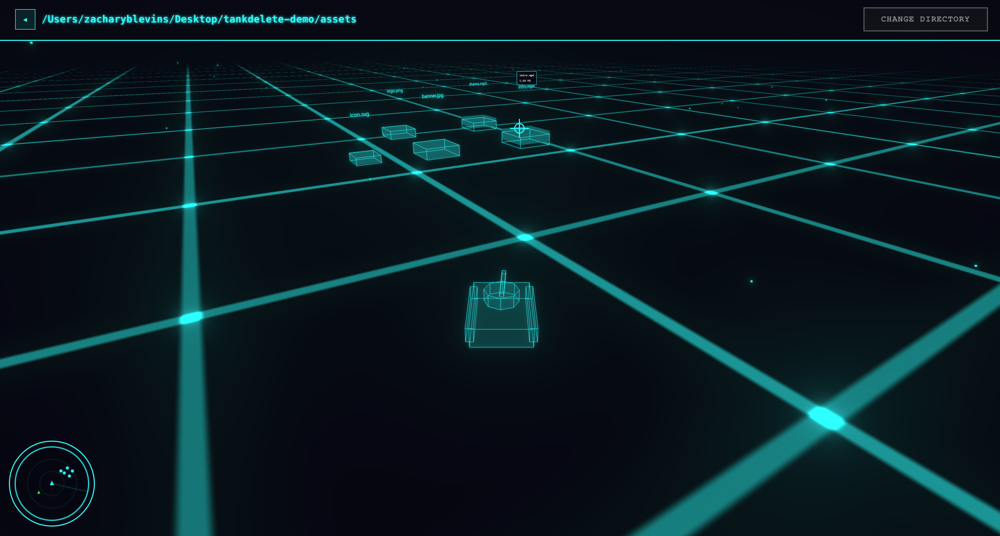
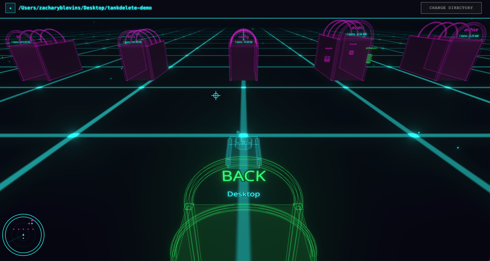

# TankDelete

Disclosure / Caution: This game was entirely created by Claude. This game is intended to be an entertaining way to delete files on your system. With that being said you are deleting files on your system so use with caution.

Drive a tank through your filesystem in a Vietnam-era-inspired field-operations arena. Navigate tactical road grids, drive through tunnel portals to enter folders, and use the cannon, flamethrower attachment, or napalm support to clear files and free disk space.





## Controls

| Input | Action |
|-------|--------|
| W / S | Drive forward / backward |
| A / D | Rotate tank left / right |
| Mouse | Aim turret |
| Left Click | Fire selected weapon |
| 1 / 2 / 3 | Select cannon / flamethrower / napalm |
| X / Delete | Trash every armed target |
| Escape | Disarm all targets |
| M | Play or mute the field radio |
| Cmd/Ctrl + Z | Undo the last trash action |
| Right Click + Drag | Orbit camera to look around |

## Gameplay

- **Pick a directory** to load it as a 3D arena
- **Boot Camp** uses virtual files so every weapon and undo flow can be practiced without touching the filesystem
- **Files** appear as colored blocks lining the tactical road grid
- **Folders** are tunnel portals — drive into them to navigate deeper
- **Back portal** takes you up one directory level
- **First hit** arms a file; a later confirmed hit moves it to the operating system trash
- **Cannon** fires a single long-range projectile
- **Flamethrower attachment** sweeps up to six nearby files in a short cone
- **Napalm support** affects a larger ground radius and has an eight-second cooldown
- **Score** tracks total megabytes freed (1 point per MB)
- **Achievements** unlock at 100MB, 1GB, and 10GB milestones

## Features

- `FIELD OPS // 1968` olive, amber, and canvas visual system
- Animated flamethrower cone and napalm burn-zone effects
- Two original polyphonic field-radio tracks generated with the Web Audio API
- Tactical tunnel portals for folder navigation
- Voxel shatter explosions with category-colored particles
- Scoring system and achievement toasts
- Radar minimap showing nearby files and portals
- Files are sent to your system trash (recoverable)
- Cross-platform: macOS, Windows, Linux

Commercial recordings and song melodies are intentionally not bundled. Licensed audio can be added later through a dedicated media pipeline without changing the gameplay code.

## Download

Grab the latest installer for your platform from the [Releases](https://github.com/zacblev1/tankdelete/releases) page:

- **macOS**: `.dmg` (Apple Silicon and Intel)
- **Windows**: `.msi` or `.exe`
- **Linux**: `.deb` or `.AppImage`

## Build from Source

Requires [Rust](https://rustup.rs/), [Bun](https://bun.sh/), and platform dependencies for [Tauri v2](https://v2.tauri.app/start/prerequisites/).

```bash
# Install dependencies
bun install

# Run in development
bun run tauri dev

# Build release installer
bun run tauri build
```

## Safety

- Every weapon preserves the two-stage mark/confirm deletion rule
- `Escape` disarms the target queue and Cmd/Ctrl+Z restores the last trash action
- Files are moved to your system trash, not permanently deleted
- System directories (`/System`, `C:\Windows`, `/usr`, etc.) are blocked
- Marked and deleting state is cleared when changing directories
- Pending napalm impacts are canceled when leaving an arena
- Failed batch deletions remain armed so they are never hidden from the player

Start with Boot Camp or a disposable test directory until you are comfortable with the controls.

## License

MIT
